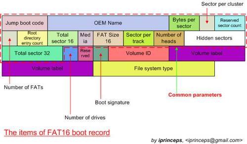
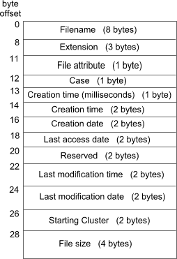

# FAT32

O setor de boot consiste em um único setor de 512 bytes que contém dois elementos,
o programa de bootstrap, carregado pela BIOS para iniciar o sistema operacional,
e o *Bios Parameter Block*. O programa de boot não nos interessa. O BPB contém
as informações do volume FAT32 que iremos operar, então ter acesso à ele é importantíssimo.

Este é o layout em disco do BPB:



Não será necesário lê-lo manualmente, já que o professor proveu a função `void rfat(FILE*, struct fat_bpb*)`
que a lê. Esta função é chamada na main e é passada ao corpo da função dos comandos
que implementaremos, então ela já vem lida na variavel `bpb`.

Este é a composição de `struct fat_bpb`:

```c
struct fat_bpb { /* bios Parameter block */
	uint8_t jmp_instruction[3]; /* code to jump to the bootstrap code */
	unsigned char oem_id[8]; /* Oem ID: name of the formatting OS */

	uint16_t bytes_p_sect; /* bytes per sector */
	uint8_t sector_p_clust; /* sector per cluster */
	uint16_t reserved_sect; /* reserved sectors */
	uint8_t n_fat; /* number of FAT copies */
	uint16_t possible_rentries; /* number of possible root entries */
	uint16_t snumber_sect; /* small number of sectors */

	uint8_t media_desc; /* media descriptor */
	uint16_t sect_per_fat; /* sector per FAT */
	uint16_t sect_per_track; /* sector per track */
	uint16_t number_of_heads; /* number of heads */
	uint32_t hidden_sects; /* hidden sectors */
	uint32_t large_n_sects; /* large number of sectors */

	/* FAT32-specific fields */
	uint32_t sect_per_fat_32;       /* Sectors per FAT (32-bit) */
	uint16_t flags;                 /* Flags (e.g., active FAT and mirroring info) */
	uint16_t version;               /* FAT32 version (typically 0x0000) */
	uint32_t root_cluster;          /* Cluster number of the root directory (typically 2) */
	uint16_t fs_info;               /* Sector number of the FSInfo structure (typically 1) */
	uint16_t backup_boot_sector;    /* Sector number of the backup boot sector (typically 6) */
	uint8_t reserved[12];           /* Reserved for future use (set to 0) */

	/* Boot sector signature */
	uint8_t drive_number;           /* Drive number (e.g., 0x80 for hard disk) */
	uint8_t reserved1;              /* Reserved (set to 0) */
	uint8_t boot_signature;         /* Extended boot signature (0x29 indicates presence of next fields) */
	uint32_t volume_id;             /* Volume ID (serial number) */
	char volume_label[11];          /* Volume label (padded with spaces) */
	char fs_type[8];                /* File system type ("FAT32   ") */

	/* Bootstrap code and signature */
	uint8_t bootstrap[420];         /* Bootstrap code */
	uint16_t signature;             /* Boot sector signature (always 0x55AA) */
};
```

Os campos importantes são `bytes_p_sect` que dá a quantidade de bytes em um setor/cluster, usado
quando formos lêr/copiar arquivos; `sector_p_clust`, pelo mesmo motivo; `root_cluster`, que indica
a posição do cluster raiz e é usado para calcular o diretório raiz.

## Tabela FAT

Em seguida, a tabela FAT consiste em um array de "ponteiros", endereços de clusters relativos
ao começo da região de dados. Cada entrada na FAT aponta para o próximo bloco do arquivo, e
para indicar o fim do arquivo, uma entrada FAT é marcada com um valor maior que 0xFFF7.

As duas primeiras entradas da FAT são especiais e não devem ser usadas para guardar um ponteiro
de cluster de arquivo. Como a FAT "verdadeira" só começa da entrada dois em diante, todos os
ponteiros, quando dereferenciados, devem ser subtraidos do valor dois.


## Diretório Raiz

O diretório raiz é uma array em disco que contém entradas de diretório, que guardam informações sobre os
arquivos/outros diretórios. A entrada mais importante de uma `struct fat_dir` é o `start_cluster`, que guarda
qual é o cluster inicial do arquivo.



Em código, é representada via a seguinte struct:

```c
struct fat_dir {
	unsigned char name[11];    /* Short name + file extension */
	uint8_t attr;              /* file attributes */
	uint8_t ntres;             /* reserved for Windows NT, Set value to 0 when a file is created. */
	uint8_t creation_stamp;    /* milisecond timestamp at file creation time */
	uint16_t creation_time;    /* time file was created */
	uint16_t ctreation_date;   /* date file was created */
	uint16_t last_access_date; /* last access date (last read/written) */
	uint16_t reserved_fat32;   /* reserved for fat32 */
	uint16_t last_write_time;  /* time of last write */
	uint16_t last_write_date;  /* date of last write */
	uint16_t starting_cluster; /* starting cluster */
	uint32_t file_size;        /* 32-bit */
};
```

## Região de dados

Está é uma área de dados brutos, então não há estrutura. Para navegar esta área,
deve-se interpretar a tabela FAT.
